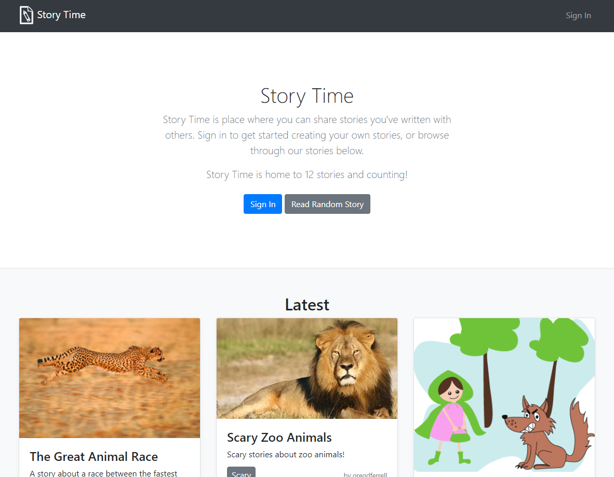
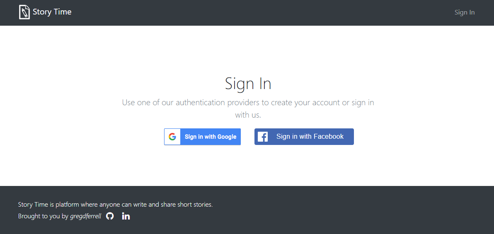
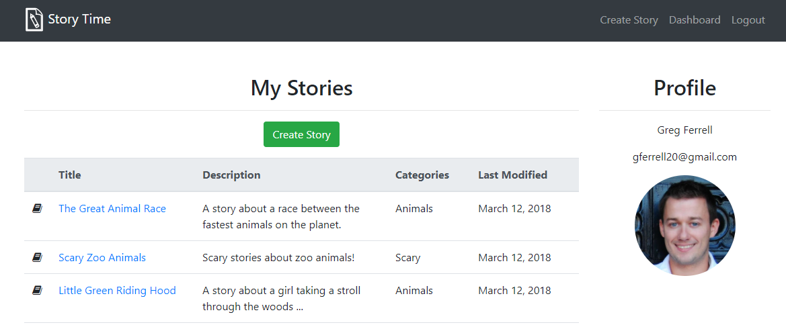

# Story Time: Udacity Nanodegree - Full Stack Web Developer Project 4
The item catalog project is the fourth project in the Udacity Nanodegree: Full Stack Web Developer.

The app is named **Story Time**.

I've used this project to further my learning with the following technologies: Python, Flask, Bootstrap, SQL Alchemy, Postgresql.

## Usage & Screenshots

### Home Page

*Read published stories:*

### Sign In

*Sign in using your Google or Facebook account:*

### Create and View My Stories

*Create, publish and view your stories once you're logged in:*

## Getting Started With Development
### Dependencies
* Python 3.5.2
* flask==0.12.2
* httplib2==0.10.3
* oauth2client==4.1.2
* requests==2.18.4
* sqlalchemy==1.1.14
* pytest==3.3.1
* flask-uploads==0.2.1
* psycopg2==2.7.4

### Setup
* Create an empty PostgreSQL DB named `storytime`
* Copy `config/story_time_template.ini` to `config/story_time.ini`
* Run the statements in `create_schema.sql` to create the DB schema
* Configure your DB connection settings in `story_time.ini`
* Register your app with Facebook and Google APIs
* Copy `config/client_secrets_facebook_template.ini` to `config/client_secrets_facebook.ini`
* Configure your Facebook App ID and Secret in `client_secrets_facebook.ini`
* Copy `config/client_secrets_google_template.ini` to `config/client_secrets_google.ini`
* Configure your Google app settings in `client_secrets_google.ini`
* Execute `python create_test_data.py` to populate your DB with test data.

### Running the App
* Execute `python app.py`

